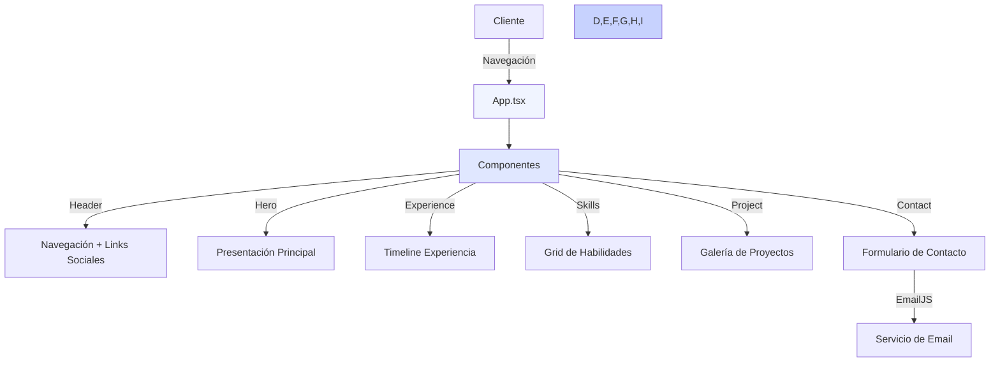

# Portfolio Personal - Harold Flores Suazo

## 🚀 Descripción
Portfolio personal desarrollado con React, TypeScript y Tailwind CSS que muestra mi experiencia profesional, habilidades técnicas y proyectos. El sitio implementa un diseño moderno, responsivo y animaciones fluidas.

## 📊 Diagrama de Arquitectura

## ⚡ Características Principales
- Diseño responsivo con Tailwind CSS
- Navegación suave entre secciones
- Formulario de contacto integrado con EmailJS
- Galería de proyectos interactiva
- Timeline de experiencia profesional
- Grid de habilidades técnicas categorizado
- Enlaces a redes sociales y portfolio
- Optimización SEO y rendimiento

## 🛠️ Tecnologías Utilizadas
- React 18
- TypeScript
- Tailwind CSS
- Vite
- EmailJS
- Lucide Icons
- React DOM

## 📋 Requisitos Previos
- Node.js (v14 o superior)
- npm o yarn
- Git

## 🚀 Instalación y Uso

1. Clonar el repositorio

git clone https://github.com/harflores/harflores.github.io.git

2. Instalar dependencias

bash
npm install

3. Configurar variables de entorno

bash
cp .env.example .env

Configura las siguientes variables en tu archivo .env:

env
VITE_EMAILJS_SERVICE_ID=tu_service_id
VITE_EMAILJS_TEMPLATE_ID=tu_template_id
VITE_EMAILJS_PUBLIC_KEY=tu_public_key

4. Iniciar en desarrollo

bash
npm run dev

5. Construir para producción

bash
npm run build

## 📁 Estructura del Proyecto

src/
├── components/
│ ├── Header.tsx # Navegación y menú responsive
│ ├── Hero.tsx # Sección principal
│ ├── Experience.tsx # Timeline de experiencia
│ ├── Skills.tsx # Grid de habilidades
│ ├── Project.tsx # Galería de proyectos
│ └── Contact.tsx # Formulario de contacto
├── assets/
│ └── projects/ # Imágenes de proyectos
├── App.tsx # Componente principal
├── main.tsx # Punto de entrada
└── index.css # Estilos globales

## 📧 Contacto
- Email: harflores.cl@gmail.com
- LinkedIn: [harflores](https://www.linkedin.com/in/harflores/)
- GitHub: [harflores](https://github.com/harflores/)
- Ubicación: Curicó, Chile

## 📄 Licencia
Este proyecto está bajo la Licencia MIT.

